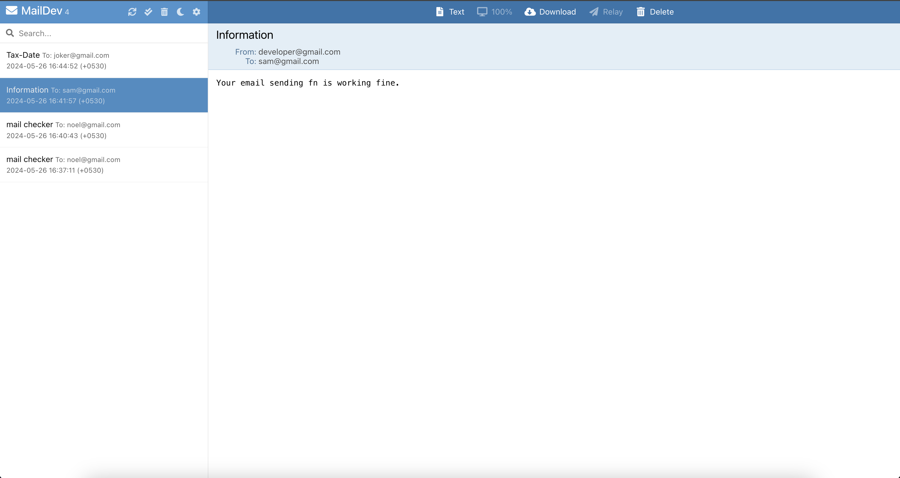

# Email Sending Application

This is a simple Node.js application using Express and Nodemailer to send emails. The application includes a basic HTML form for users to input their email address, subject, and message. The form data is then sent to the server, which uses Nodemailer to send an email.

## MailDev Screenshort


## Installation

1. Clone the repository:

```sh
git clone https://github.com/Lovenoelkujur/Email-sending-application.git
cd email-sending-app
```

2. Install the dependencies:
```sh
npm install
```

## Usage

### Using MailDev

MailDev is an SMTP server to catch emails in your development environment. It is already configured in the `index.js` file:

```javascript
const transporter = nodemailer.createTransport({
    host: '0.0.0.0',
    port: 1025,
    secure: false
});
```

### Using Gmail

To use Gmail as your email service, uncomment the Gmail configuration and comment out the MailDev configuration in the `index.js` file:

```javascript
// Gmail
const transporter = nodemailer.createTransport({
    service: "gmail",
    host: 'smtp.gmail.com',
    port: 465,
    secure: true,
    auth: {
      user: process.env.EMAIL_USERNAME,
      pass: process.env.EMAIL_PASSWORD
    }
});
```

## Configuration

### MailDev

To use MailDev, you need to install it globally and run it:

```sh
npm install -g maildev
maildev
```

### Environment Variables

If you are using Gmail, create a `.env` file in the root directory and add your email credentials:

```makefile
EMAIL_USERNAME=your_email@gmail.com
EMAIL_PASSWORD=your_password
```
MailDev's web interface will be available at `http://localhost:1080`.

## Running the Application

1. Start the Express server:

```sh
node index.js
```
2. Open your browser and navigate to `http://localhost:9000`.

3. Fill out the form and submit to send an email.

### License
This project is licensed under the MIT License. See the `LICENSE` file for details.